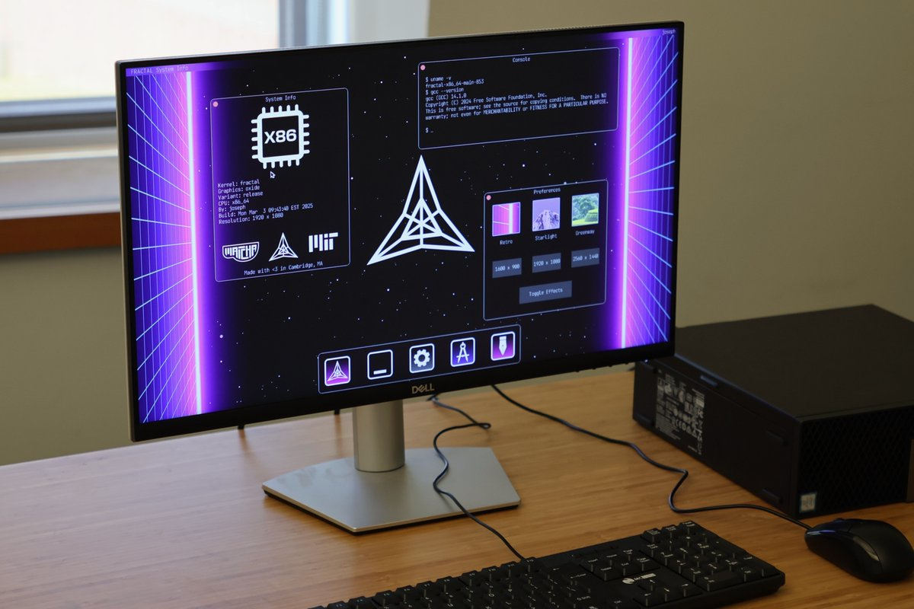

# Fractal



*A photo of Fractal running with GUI mode enabled on a real X86 PC. The
keyboard, mouse, serial port, and display all work.*

This repository contains the full source code for the Fractal kernel. This file
includes instructions for building and running Fractal on a variety of places,
as well as documentation for Fractal's unique and bespoke system calls.

# What is Fractal?

Fractal is an operating system designed for microarchitecture reverse
engineering. That means reverse engineering things like the branch predictor,
cache, interconnect, etc. Given a new piece of hardware, the idea is you can
boot Fractal directly on it and perform your experiments under Fractal.

Fractal is a lightweight UNIX-like custom operating system, so you get "the
best of both worlds". You retain access to a C library and ports of tools like
binutils, coreutils, dash, vim, and gcc so working with Fractal feels familiar
if you're coming from something like Linux or BSD. Additionally, Fractal adds
new scheduling and privilege switching primitives as well as APIs for working
with microarchitecture structures to quickly enable microarchitecture reverse
engineering experiments.

With Fractal, you can vary the privilege level of different parts of the same
program (we call this "multi-privilege concurrency"), switch between privilege
levels without ever issuing a single branch instruction (we call this
"branchless context switches" / "ultrathreads", currently AARCH64-only), and
quickly create massive virtual regions of repeated instructions or data (we
call this the "gmap"), which is common in these kinds of experiments.

# Project History

The vast majority of the Fractal kernel was written from June to December 2024.
Absolutely zero lines of code in Fractal were written by AI. All code was
written by me (Joseph Ravichandran) except for third party dependencies where
specified.

We submitted a paper using Fractal to study Apple Silicon to IEEE S&P as part
of Cycle 2 in November 2025 and were accepted. We announced Fractal in May 2026
at S&P in San Francisco.

# Building Fractal

### Building the Compiler

First, you need to build or acquire the Fractal gcc toolchain. `cd toolchain;
./mk_toolchain.sh all` to build one. It will take around 30 minutes to build
for all architectures.

The toolchain consists of a number of utilities named
`$(ARCH)-fractal-elf-$(TOOL)`. This includes all of `binutils`, `gcc`, and
`gdb`, for each architecture supported by Fractal. Once the toolchain is built,
you need to add the `out/bin` folder to your path so that the kernel and user
Makefiles can find these tools.

The toolchain includes `newlib` with bindings to Fractal system calls (built
into the `libc.a` and `crt0.o` files, per-architecture). This allows you to
build any regular C program and automatically have it statically link with a
Fractal-compatible C library.

### Making a Filesystem

Fractal relies on an initial ramdisk (initrd) to load userspace programs. The
ramdisk is just an ext2 filesystem image copied into memory. Instead of
performing disk I/O, Fractal mutates the disk image in memory at runtime. You
need to build an initrd for the kernel to boot. Without it, you won't be able
to run user programs.

For targets with bootloader support for ramdisks (X86 PC's and Raspberry Pi),
the ramdisk is a separate file. For "embedded" targets (Apple Silicon), we
embed the ramdisk within the installable kernel image (the `.img` file).

First, we build the user programs the image will include, then we create an
ext2 filesystem image which can be copied to target computer running Fractal.
This process is very similar to building the toolchain, except now instead of
compiling tools that will run on the host (your computer) and target Fractal,
these tools are compiled to run *within* Fractal.

Filesystems are folders in `filesys/fs_$(TARGET)`. Normally, `$(TARGET)` is the
full ISA name (eg. `x86_64`, `aarch64`, or `riscv64`), or for embedded systems
like Raspberry Pi, we define a separate target for them (eg. `raspi`) with
fewer files to keep the image sizes small and easy to work with.

The filesystem for a given architecture is a file named:

```
disk.$(TARGET).ext2
```

### Building the Kernel

Fractal supports several real-world and virtual systems across three
architectures- `x86_64`, `aarch64`, and `riscv64`. Fractal refers to these as
`x86`, `arm`, and `rv`, respectively.

A full build invocation for the kernel looks something like this:

```bash
make -j VARIANT=$(VARIANT) BOARD=$(BOARD) SOC=$(SOC)
```

Where:
- `VARIANT` is one of: `RELEASE` (default, you should use this one) or `DEBUG` (only use if you're debugging something in the kernel).
- `BOARD` is one of the supported board types (see Supported Boards below). The default is a board named `QEMU` which builds a kernel suitable for running in a Qemu VM for all architectures.
- `SOC` is the kind of SoC (system on a chip) for this specific board. Only certain targets support this.

The architecture is inferred from the kind of board requested and can be
omitted. By default, Fractal will be compiled for all architectures supported
by the board you have selected. If you want to limit to compiling only a subset
of the possible architectures for your board, you can by adding `$(ARCH)` (not
`ARCH=$(ARCH)`) to the end of the build command, where `$(ARCH)` is one or more
of `x86`, `arm`, or `rv`.

Compiled kernels are stored in the `bin` folder and are named as follows:

```
fractal.$(VARIANT).$(BOARD).$(ARCH)
```

For certain embedded targets, an installable binary image will be created with
the `.img` extension at the end. This image is a flat binary that can be copied
into memory by a bootloader and jumped to to begin running Fractal (as opposed
to an ELF file that would require an ELF-aware bootloader to load, like how
Qemu runs kernels with the `-kernel` option).

Intermediate objects are located in their relative path in `bin` and are named
as follows:

```
$(OBJECT_NAME).$(ARCH).$(VARIANT).$(BOARD).o
```

Note that the ordering of these names is different than the ordering of the
output kernel. This is intentional to reduce the chance of confusing the final
kernel image with an intermediate object file.

### Compilation Examples

- Build Fractal to run in Qemu for all supported architectures: `make BOARD=QEMU`
- Build Fractal for Raspberry Pi: `make BOARD=RASPI`
- Build Fractal for an Apple M1 Mac: `make BOARD=APPLE SOC=M1`
- Build `x86_64` Fractal for debugging in Qemu: `make BOARD=QEMU VARIANT=DEBUG x86`
- Run a parallel build (makes building faster): add `-j` to the `make` invocation. Eg: `make -j BOARD=QEMU arm`
- Clean the build folder: `make clean`

## Supported Boards
We support the following boards:
- `QEMU`: This board compiles a kernel image suitable for running in a Qemu VM. This can include support for VirtIO graphics and HID input devices, along with detecting ramdisks where Qemu places them.
- `RASPI`: A Raspberry Pi 4B device. The `fractal.release.raspi.arm.img` file can be directly copied and installed onto a Raspberry Pi.
- `APPLE`: An Apple Silicon Mac. Currently we support three flavors of Apple Silicon, differentiated using the `SOC` argument: `M1`, `M4`, and `VMAPPLE`.
- We also support GRUB-based `x86_64` PCs, reusing the `QEMU` board for `x86` installed into a GRUB rescue image (more info below).

### Apple Silicon

We support the following kinds of Apple Silicon devices (specified with
`SOC=$(SOC)`):

- `M1` for M1 Mac Minis
- `M4` for M4 Mac Minis
- `VMAPPLE` for `vma2` Virtualization.framework VMs (assumed to have a PL011 serial port instead of the Samsung / Apple one on real Macs)

To interact with an Apple Silicon Mac, you'll need a USB SuperSpeed cable and another Mac.
Clone the Asahi Linux `macvdmtool` and install it on the second Mac (`https://github.com/AsahiLinux/macvdmtool`).
Additionally, install `picocom` with `brew install picocom`.

To attach to Fractal running on a target Mac:
1. Attach the USB cable to the DFU port of both machines (the DFU port is different for different models, check Apple's website to see where it is on your Macs)
2. Open a picocom window with `picocom -q --omap crlf --imap lfcrlf -b 115200 /dev/cu.debug-console`
3. Use `sudo macvdmtool reboot serial` to reboot the target Mac
4. You should see Fractal appear in the `picocom` window.

Check the current Asahi Linux `macvdmtool` instructions when you try to run this, as it can change with macOS revisions.
As of macOS 15 Sequoia, I have found you do not need to disable the `AppleSerialShim.kext` kernel extension to get access to `/dev/cu.debug-console`.

**Caveats**
- M4 support only works if your M4 target Mac is running macOS 15.1 exactly. macOS 15.2-15.4 do **NOT** work. You may need to use Apple Configurator to flash a macOS 15.1 IPSW over the DFU port. Make sure to use the 15.1 IPSW that is built for M4 Macs, as it is different than the 15.1 IPSW for other Macs. This is due to a bug in iBoot introduced in macOS 15.2 with loading custom kernels.

### GRUB PCs

When running Fractal on GRUB PCs, we compile a `.iso` image that can be flashed
to a flash drive with `dd` and booted directly. To accomplish this, we create
an ISO9660 filesystem recovery image with GRUB installed.

Use the following for your GRUB configuration file:

```
menuentry "fractal" {
  echo "Loading fractal.release.x86_64"
  insmod progress
  multiboot /fractal.release.x86
  echo "Loading initrd"
  module /disk.x86_64.ext2
  boot
}
```

This uses a GRUB boot module to bootstrap the disk image into memory and run
the kernel. The kernel must be multiboot-complaint, which our default `QEMU`
builds are (as Qemu also requires multiboot compliance for loading `x86`
kernels).

Note that the Fractal kernel for Qemu is `objcopy`'d to be a 32-bit ELF rather
than a 64-bit one. This is just because Qemu only currently loads 32-bit
multiboot images. We begin running in 32-bit mode but quickly bootstrap
ourselves into 64-bit mode. The ELF format does not care about what kind of
code is actually contained within, so `objcopy`'ing from a 64-bit ELF down to a
32-bit one produces the same code, just a different file format so Qemu is
happy.

You can use `grub-mkrescue` to build an ISO. Then `dd` the ISO onto a flash
drive, stick it in any GRUB-compatible 64 bit PC, and select `fractal` from the
GRUB menu.

You'll need PS/2 support to use the keyboard and mouse (or a motherboard that
supports translating I2C / USB peripherals into PS/2). You can also use the
serial port, if your PC has one.

## Supported Hardware

|   | `X86_64`  | `ARM64`  | `RISC-V` |
|---|---|---|---|
|Timer Source   | LAPIC   | Generic Timer  |M-Mode `mtime`   |
|Interrupt Controller   | APIC (LAPIC/ IOAPIC)   | Generic Interrupt Controller (GIC)  | PLIC   |
|Floating Point| Yes (X87) | Yes (FPU) | Yes (F and D Extensions) |
|Init Ramdisk|Yes (via Multiboot) | Yes (fixed offset) | Yes (fixed offset) |
|SIMD/ Vector | Yes (SSE 4.2) | Yes (NEON) | No |
|Serial  | UART16550  | PL011  |UART16550   |
|ACPI Support |Yes | N/A | N/A |
|PCIe Support | Yes | Yes | Yes |
|Virtio GPU |Yes (PCI) | Yes (PCI) | Yes (PCI) |
|Virtio Keyboard| Yes (PCI) | Yes (PCI) | Yes (PCI) |
|Virtio Mouse| Yes (PCI) | Yes (PCI) | Yes (PCI) |
|Virtio Tablet| Yes (PCI) | Yes (PCI) | Yes (PCI) |

## System Calls

| # |      Name      |          Arg 1          |          Arg 2          |          Arg 3          |
|---|----------------|-------------------------|-------------------------|-------------------------|
|0  | Handoff        |                         |                         |                         |
|1  | Spawn          | `char*` Path            | `u64` Mode              |                         |
|2  | Quit           | `u64` Reason            |                         |                         |
|3  | Open           | `char*` Path            |                         |                         |
|4  | Read           | `u32` File Descriptor   | `u8*` Buffer            | `usize` Number of Bytes |
|4  | Write          | `u32` File Descriptor   | `u8*` Buffer            | `usize` Number of Bytes |
|6  | Close          | `u32` File Descriptor   |                         |                         |
|7  | Stat           | `u32` File Descriptor   | `struct stat*` Buffer   |                         |
|8  | Seek           | `u32` File Descriptor   | `i32` Offset            | `int` whence            |
|9  | Mkdir          | `char*` Path            |                         |                         |
|10 | Chdir          | `char*` Path            |                         |                         |
|11 | Fork           |                         |                         |                         |
|12 | Execve         | `char*` Path            | `char**` Argv           | `char**` Envp           |
|13 | Wait           | `u64*` Exit Code        | `u64` Flags             |                         |
|14 | Getdents       | `u32` File Descriptor   | `dirent_t*` Buffer      | `usize` Number of Bytes |
|15 | Pipe           | `u32[2]` F. Descriptors |                         |                         |
|16 | Dup            | `u32` Fildesc From      |                         |                         |
|17 | Dup2           | `u32` Fildesc From      | `u32` Fildesc To        |                         |
|18 | Fcntl          | `u32` File Descriptor   | `u64` Command           | `u64` Command Argument  |
|19 | Uname          | `struct utsname` name   |                         |                         |
|20 | Fstatat        | `u32` File Descriptor   | `char*` Path            | `u32` Flags             |
|21 | Openat         | `u32` File Descriptor   | `char*` Path            | `u64` Flags             |
|22 | Fchdir         | `u32` File Descriptor   |                         |                         |
|23 | Access         | `char*` Path            | `u64` Mode              |                         |
|24 | Sysconf        | `u64` Conf Name         |                         |                         |
|25 | Unlink         | `char*` Path            |                         |                         |
|26 | Waitpid        | `pid_t` PID             | `u64*` Exit Code        | `u64` Flags             |
|27 | Getpid         |                         |                         |                         |
|28 | Kexec          | `char*` Path            |                         |                         |
|29 | Fractal        | `u64` Command           | `u64` Argument          |                         |
|30 | Select         | `i32` Num FDs           | `void*` Read FDs        | `void*` Write FDs (...) |
|31 | Poll           | `void*` FDs             | `i32` Num FDs           | `i32` Timeout           |
|32 | Tcgetattr      | `i32` File Descriptor   | `void*` Termios Pointer |                         |
|33 | Tcsetattr      | `i32` File Descriptor   | `i32` Optional Actions  | `void*` Termios Pointer |
|34 | Rmdir          | `char*` Filename        |                         |                         |
|35 | Sbrk           | `i32` Increment Amount  |                         |                         |
|36 | Fthread Create | `fthread_t*` Fthread    | `u64` Attributes        | `void*` Entrypoint (...)|
|37 | Fthread Join   | `fthread_t` Fthread     | `void*` Value Pointer   |                         |
|38 | Fthread Exit   | `void*` Return Value    |                         |                         |
|39 | Fthread Switch | `fthread_t` Fthread     |                         |                         |
|40 | Mprotect       | `void*` Base Address    | `usize` Length          | `u64` Protection Flags  |
|41 | Fmap           | `void**` New Page Ptr   | `usize` Num Copies      | `usize` Log Stride      |
|42 | Xlate          | `u64` Virtual Address   | `u64*` Physical Address |                         |
|43 | Funmap         | `void*` Page to Free    |                         |                         |
|44 | Gigamap        | `gigaopt_t` Command     | `u64` Argument          |                         |

# Dependencies

## Build-Time

- Kernel and Userspace: `gcc` / `binutils` cross compiler (build script provided in `toolchain`), `make`, `tr`, `find`, `cat`, `echo`.
- Userspace only: `make` / `newlib` / `autoconf` / `automake` (build script provided in `toolchain`)
- `bash` (for `tool/mk_version.sh`, used during build process)
- `tar` (for building the file system)

*Note*: The cross-compiler is reused for both kernel and userspace, so `make`, `newlib`, `autoconf`, and `automake` are built for the kernel cross compiler, even though the kernel does not depend on these components.

## Run-Time
For running in a VM:
- `qemu-system-x86_64`, `qemu-system-aarch64`, and `qemu-system-riscv64`

*Note*: For `qemu-system-aarch64` to work with `initrd` properly, `qemu.patch` must be applied before compiling qemu.
Tested with Qemu 9.0.1.

Qemu config:

```
--target-list=x86_64-softmmu,aarch64-softmmu,riscv64-softmmu --enable-sdl --disable-gtk
```

## Other
These programs aren't part of the build process, but are useful for creating font assets or `.bin` files used in Oxide:
- `python3` (for generating sprites and fonts)
- `otf2bdf` (for generating BDF fonts)

## Useful Tools
- Font Forge, for working with fonts

## Python Packages
- `numpy`
- `scikit-image`
- `matplotlib`
- `Pillow`

# Third Party Code

The core Fractal kernel modifies or uses third party dependencies in a few places:

- [The kernel object heap uses Doug Lea's dlmalloc](https://gee.cs.oswego.edu/pub/misc/malloc.c)
- [iBoot bootloader headers are from XNU](https://github.com/apple-oss-distributions/xnu/blob/xnu-11215.81.4/pexpert/pexpert/arm64/boot.h)
- [Apple Silicon UART Driver is modified from the Asahi Linux m1n1 project](https://github.com/AsahiLinux/m1n1)
- [Raspberry Pi UART Driver is modified from the OSDev wiki](https://wiki.osdev.org/Raspberry_Pi_Bare_Bones)
- [Fast memcpy and memset are taken from newlib](https://sourceware.org/newlib/)
